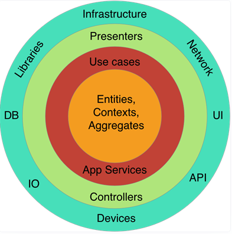
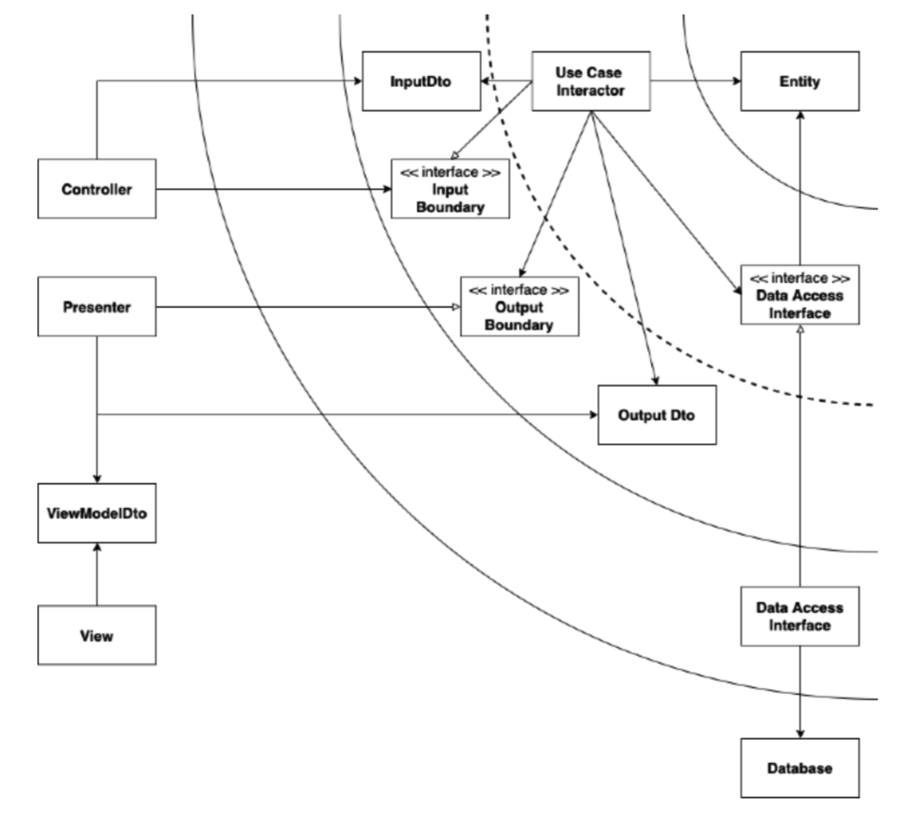
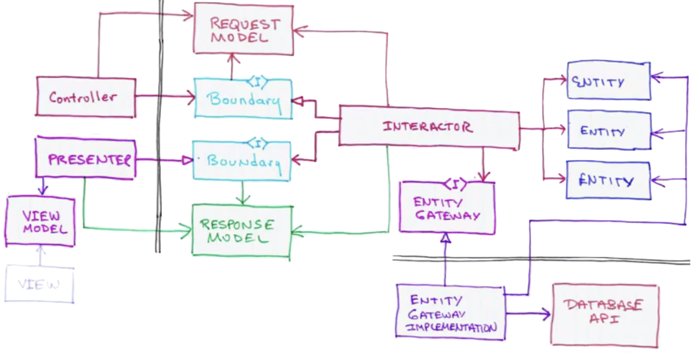

#### [GO TO BACK](../README.md)

# 0. 도메인 주도 설계(DDD)가 필요하게 된 이유
### 1. CRUD 방식의 문제점
- 생명 주기가 단일 model이 아닌 경우 로직이 복잡해 진다.
- code가 강하게 결합 되어 있는 경우, 파악, 변경이 어려우며 테스트도 어려움  
    ex1) database, web framework code 등등  
    ex2) 3th party 서비스와 연동이 힘듬

### 2. Clean Architecture의 장점
- framework의 독립성: 느슨한 결합으로 프레임워크를 업그레이드 하거나 교체가 쉬움
- Testability: unit test에 용이함
- Independence of UI/API: 의존성 낮춤
- Independence of Database: 데이터베이스 의존성 낮춤
- Independence of any 3rd party: ex) 비즈니스 로직은 어떻게 결제 모듈을 사용하는지 알 필요가 없음
- Flexibility: 유연성
- Extensibility: 확장성, CQRS, Event-Sourcing, DDD 방식 적용 가능  
    확인해보기 [링크](https://www.popit.kr/cqrs-eventsourcing/)

### 3. Clean Architecture의 Layer
- External World: code 외부. Network, DB, 외부 API 등등
- Infrastructure: DB, API adapter 역할
- Application: 
    - Use Case: Single Operation(하나의 비즈니스로직 - user 하나의 action)으로 구성됨  
        ex) 입찰하기, 입찰 취소하기
    - Interface: 추상화된 use case, infrastructure를 추상화
- Domain: identity를 가진 Entity로 구성됨. 비즈니스룰을 담고 있음.

- Dependency Rule: External World -> Infrastructure -> Application -> Domain
    ex) 상위는 하위를 사용할 수 있지만, 하위는 하위를 사용 못함
- Business Rule과 Processes 들은 Application Layer, Domain Layer 에서 이루어짐
    External World를 몰라도 Business Logic을 단위 테스트 할 수 있음
- Boundary는 여러게 Interface 들로 정의 됨. 모든 detail은 Boundary 안에 숨어있음
- Input DTO, Ouput DTO, Input Boundary는 Application Layer 안에 Detail을 숨기는 Boundary 형성
    - Input DTO: Boundary에 진입할 수 있는 request
    - Output DTO: Boundary에서 반환하는 Response
    - Input Boundary: Use Case를 추상화한 Interface

### 4. Control Flow in Architecture

[출처](https://teamsmiley.github.io/2019/02/02/clean-architecture/)
- Controller는 HTTP request data를 repack해서 InputDTO로 Input Boundary에 전달
- Input Boundary는 InputDTO를 이용하여 필요한 Entity를 Data Access Interface(인프라 인터페이스)를 이용하여 Database부터 fetch 함
- Entity가 Business Logic을 수행. Data Access Interface(인프라 인터페이스)를 통해 변경 사항을 저장
- Use Case는 Output DTO를 return 함. Presenter의 Interface 역할을 하는 Output Boundary에 전달. Presenter은 OutputDTO를 reformat하여 View 보여줌

[참조 블로그](https://velog.io/@jahoy/Python%EC%9C%BC%EB%A1%9C-Clean-Architecture-%EC%A0%81%EC%9A%A9%ED%95%98%EA%B8%B0)
